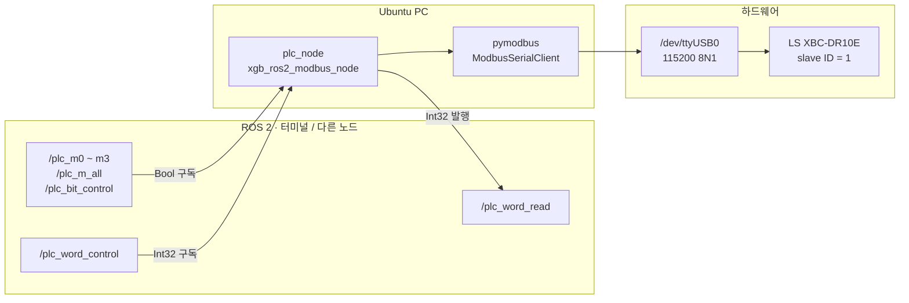
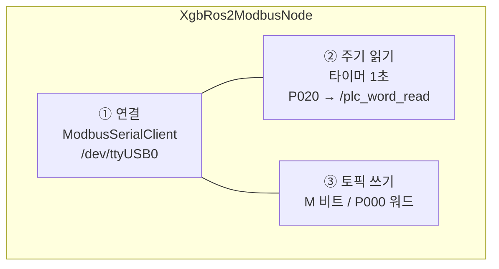
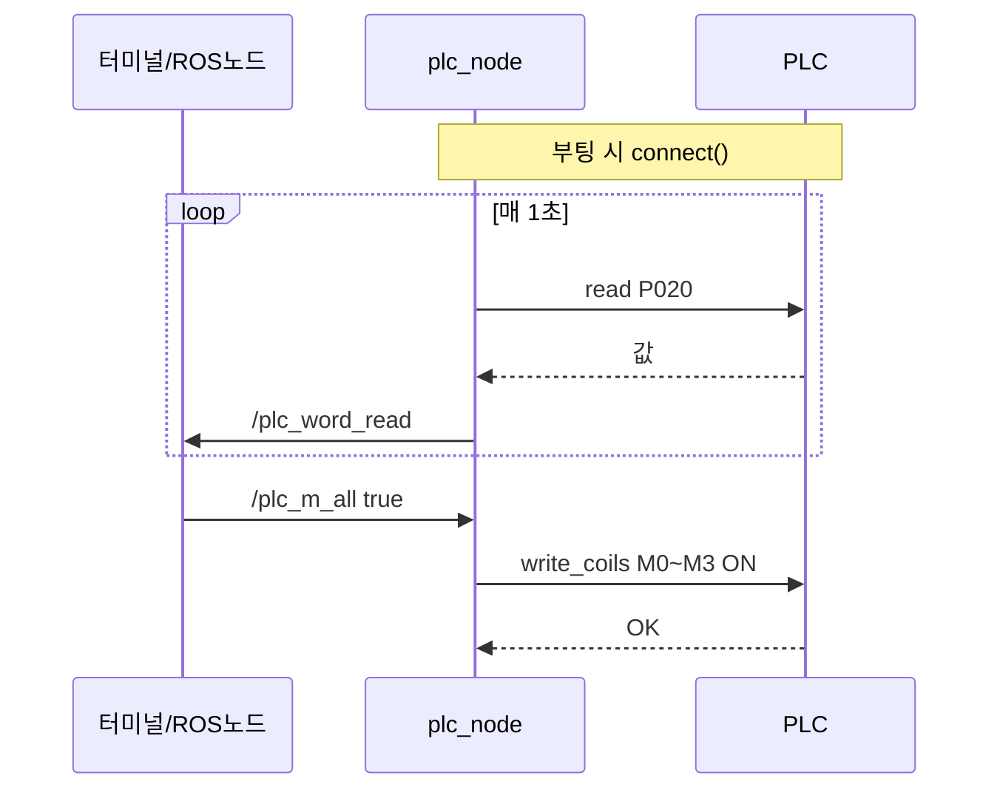

# xgb_plc_modbus

LS **XBC-DR10E** PLC ↔ **ROS 2 Humble** Modbus RTU 브리지 패키지.

- 노드: `xgb_ros2_modbus_node`
- 실행 파일: `plc_node`
- 시리얼: `/dev/ttyUSB0`, 115200 8N1, slave ID `1`

---

## 새 컴퓨터 사전 설정 (클론 & 빌드 **전에** 필수)

다른 PC에서 처음 셋업할 때, **코드 clone 전에** 아래 3가지만 하면 CH340 USB-RS485가 잡히고 권한 에러 없이 동작합니다.  
(별도 Windows式 드라이버 수동 설치는 보통 필요 없습니다.)

### ① `brltty` 제거 (가장 중요)

Ubuntu에 점자 디스플레이용 `brltty`가 있으면 **CH340 인식을 가로채** `/dev/ttyUSB*` 가 안 보이거나 바로 사라질 수 있습니다.

```bash
sudo apt remove brltty
```

> **주의:** 제거 후 **USB 컨버터를 뺐다가 다시 꽂아야** 정상 인식됩니다.

### ② 시리얼 포트 이름 확인

PC·USB 포트마다 `ttyUSB0`이 아니라 `ttyUSB1` 등일 수 있습니다.

```bash
ls /dev/ttyUSB*
```

노드 기본값은 `/dev/ttyUSB0` 입니다. 번호가 다르면 `xgb_plc_modbus/plc_node.py` 의 `port=` 를 해당 이름으로 수정한 뒤 다시 `colcon build` 하세요.

### ③ 포트 권한 (영구 권장)

**영구 (권장)** — `dialout` 그룹에 사용자 추가. **로그아웃 후 재로그인** 또는 재부팅 필요.

```bash
sudo usermod -aG dialout $USER
# 재로그인 후 확인
ls -l /dev/ttyUSB0
groups   # dialout 포함 여부
```

**당장만 테스트** — 임시로:

```bash
sudo chmod 666 /dev/ttyUSB0
```

> 재부팅·USB 재연결 후에는 `chmod` 를 다시 쳐야 할 수 있습니다.

**요약:** 새 PC → ① `brltty` 제거 + USB 재연결 → ② `ls /dev/ttyUSB*` 확인 → ③ `dialout` 등록(또는 `chmod`) → 그다음 clone & 빌드.

---

## 클론 & 빌드

워크스페이스 이름은 다른 프로젝트 `ros2_ws` 와 겹치지 않게 **`plcmodbus_ws`** 를 씁니다.

```bash
mkdir -p ~/plcmodbus_ws/src
cd ~/plcmodbus_ws/src
git clone https://github.com/jasper104615-collab/plcmodbus485.git xgb_plc_modbus

cd ~/plcmodbus_ws
source /opt/ros/humble/setup.bash
colcon build --packages-select xgb_plc_modbus
source install/setup.bash
```

## 실행

```bash
ros2 run xgb_plc_modbus plc_node
```

## 의존성

```bash
sudo apt install ros-humble-rclpy ros-humble-std-msgs -y
pip3 install pymodbus pyserial
pip3 uninstall serial -y   # pyserial 과 충돌하는 패키지 제거 (있을 때만)
```

USB·`brltty`·포트 권한은 위 **「새 컴퓨터 사전 설정」** 절 참고.

---

# xgb_plc_modbus 구조 정리

> **XGB PLC · ROS2 Humble · Architecture Guide**

**ROS2 토픽** ↔ **plc_node** ↔ **Modbus RTU** ↔ **PLC (XBC-DR10E)**

단일 브리지 노드 + 토픽 API

---

## 전체 그림 (한 줄 요약)

**ROS2 Topic** ↔ **plc_node** ↔ **Modbus RTU** ↔ **XBC-DR10E**

PC에서 `ros2 topic pub`로 명령을 내면, 노드가 USB 시리얼 `/dev/ttyUSB0` (115200 8N1)로 PLC 메모리(M, P)를 읽고 씁니다.

### 시스템 구조도



---

## 01 · 패키지 / 파일 구조

> 워크스페이스 `~/plcmodbus_ws` · 패키지 하나 · 노드 하나

```
~/plcmodbus_ws/
├── src/xgb_plc_modbus/          ← ROS2 패키지 (ament_python)
│   ├── package.xml              ← rclpy, std_msgs, pymodbus
│   ├── setup.py                 ← entry_points: plc_node
│   └── xgb_plc_modbus/
│       └── plc_node.py          ← 실제 로직 전부
├── build/
└── install/
    └── lib/xgb_plc_modbus/plc_node   ← ros2 run 실행 파일
```

| 계층 | 이름 | 역할 |
| --- | --- | --- |
| 패키지 | `xgb_plc_modbus` | PLC↔ROS2 브리지 묶음 |
| 실행 파일 | `plc_node` | `setup.py` entry_points로 등록 |
| ROS 노드 | `xgb_ros2_modbus_node` | `plc_node.py` 안 Node 클래스 이름 |

```bash
ros2 run xgb_plc_modbus plc_node
#        ↑ 패키지명        ↑ 실행 파일명
```

---

## 02 · 노드 내부 구조

> `plc_node.py` · 역할 3가지

### 노드 역할 다이어그램



### ① 시리얼 연결 (시작 시 1회)

- `pymodbus` `ModbusSerialClient` → `/dev/ttyUSB0`, 115200, 8N1
- PLC 국번(slave) = **1** (`device_id=1`)

### ② 읽기 (1초마다 자동)

| PLC | Modbus | 동작 |
| --- | --- | --- |
| P020 | Holding Register **주소 0** | `read_holding_registers` → `/plc_word_read` 발행 |

### ③ 쓰기 (토픽 올 때마다)

| ROS 토픽 | 메시지 | PLC | Modbus |
| --- | --- | --- | --- |
| `/plc_bit_control` | Bool | M0000 | `write_coil` addr **0** |
| `/plc_m0` ~ `/plc_m3` | Bool | M0000~M0003 | `write_coil` addr **0~3** |
| `/plc_m_all` | Bool | M0000~M0003 일괄 | `write_coils` addr 0, 4개 |
| `/plc_word_control` | Int32 | P000 | `write_register` addr **0** |
| `/plc_word_read` | Int32 | P020 | `read_holding_registers` addr **0** (1초) |

> **주소 0 = PLC 시작점** — XG5000에서 비트 쓰기 M0000, 워드 쓰기 P000, 워드 읽기 P020으로 설정한 매핑과 일치합니다.

**토픽 목록**

- 구독: `/plc_m0` `/plc_m1` `/plc_m2` `/plc_m3` `/plc_m_all` `/plc_bit_control` `/plc_word_control`
- 발행: `/plc_word_read`

---

## 03 · 데이터 흐름

> pub/sub만 사용 · 서비스/액션 없음



- **Subscriber** — ROS → 노드 → PLC **쓰기** 명령
- **Publisher** — PLC → 노드 → ROS **읽기** 결과

---

## 04 · 다른 ROS 패키지와의 관계

> doosan-robot2 등과 독립 · 나중에 토픽으로 연동

```
cube-solver / 로봇 노드들  ←→  (아직 직접 연결 안 함)
         │
         │  원하면 나중에
         │  /plc_m_all pub 또는
         │  /plc_word_read subscribe
         ▼
    xgb_plc_modbus / plc_node  ←→  PLC (Modbus RTU)

※ 그리퍼/로봇 노드는 Modbus 직접 사용 안 함 — 이 브리지 노드만 PLC 담당
```

---

## 05 · PLC 메모리 대응

> 래더 / XG5000 기억용

| 사용자 말 | PLC 메모리 | 노드에서 |
| --- | --- | --- |
| M0, M1, M2, M3 | M0000~M0003 | `/plc_m0`~`/plc_m3`, `/plc_m_all` |
| P0040 출력 | M0000 ON → 릴레이 (래더) | `/plc_bit_control` 또는 `/plc_m0` true |
| 숫자 쓰기 | P000 | `/plc_word_control` Int32 |
| 숫자 읽기 | P020 | `/plc_word_read` (1초마다) |

> M1~M3만 켜도 출력이 없으면 래더에 M1~M3→출력 연결이 없을 수 있습니다. (M0만 P0040에 연결된 설정이 흔함)

---

## 06 · 실행 & 확인 명령

```bash
# 노드 실행
source /opt/ros/humble/setup.bash
cd ~/plcmodbus_ws && colcon build --packages-select xgb_plc_modbus
source install/setup.bash
ros2 run xgb_plc_modbus plc_node

# M0~M3 전부 ON / OFF (일괄)
ros2 topic pub --once /plc_m_all std_msgs/msg/Bool "{data: true}"
ros2 topic pub --once /plc_m_all std_msgs/msg/Bool "{data: false}"
```

### 개별 비트 ON / OFF (M0 ~ M3)

| 비트 | ON | OFF |
| --- | --- | --- |
| M0 | `ros2 topic pub --once /plc_m0 std_msgs/msg/Bool "{data: true}"` | `ros2 topic pub --once /plc_m0 std_msgs/msg/Bool "{data: false}"` |
| M1 | `ros2 topic pub --once /plc_m1 std_msgs/msg/Bool "{data: true}"` | `ros2 topic pub --once /plc_m1 std_msgs/msg/Bool "{data: false}"` |
| M2 | `ros2 topic pub --once /plc_m2 std_msgs/msg/Bool "{data: true}"` | `ros2 topic pub --once /plc_m2 std_msgs/msg/Bool "{data: false}"` |
| M3 | `ros2 topic pub --once /plc_m3 std_msgs/msg/Bool "{data: true}"` | `ros2 topic pub --once /plc_m3 std_msgs/msg/Bool "{data: false}"` |

```bash
# 확인
ros2 node list
ros2 node info /xgb_ros2_modbus_node
ros2 topic list | grep plc
ros2 topic echo /plc_word_read
```

---

## 정리

- 구조: **단일 브리지 노드 + 토픽 API** (멀티 노드/서비스 구조 아님)
- 로봇이 PLC를 쓰려면 이 노드의 토픽만 pub/sub 하면 됨

| 항목 | 값 |
| --- | --- |
| Package | `xgb_plc_modbus` |
| Workspace | `~/plcmodbus_ws` |
| PLC | LS XBC-DR10E · Modbus RTU slave 1 |
| Repository | https://github.com/jasper104615-collab/plcmodbus485 |
